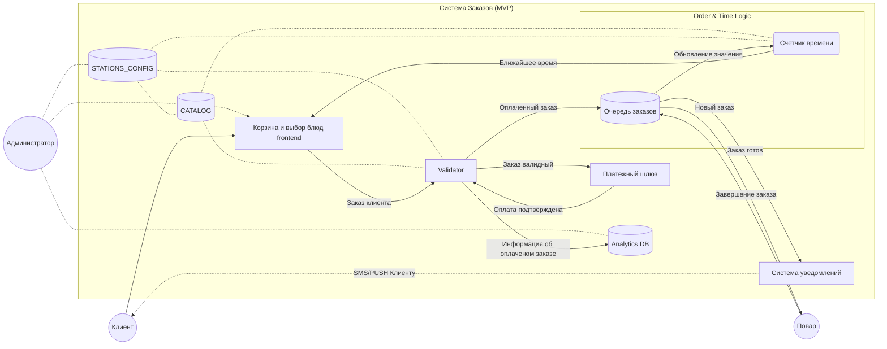
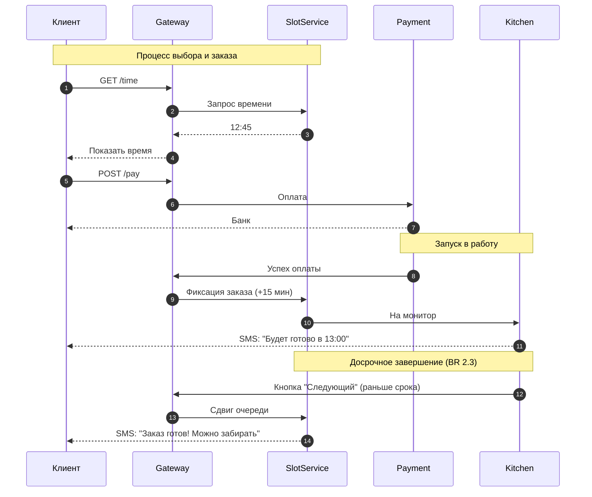
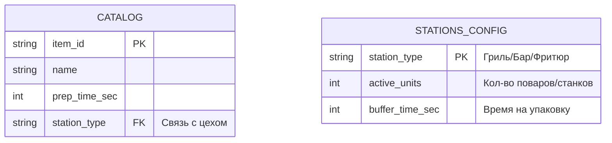

# EPIC 01: Выбор блюд и оформление заказа

**Статус:** [MVP]

**Бизнес-цель:** Автоматизировать и оптимизировать процесс приема, готовки и оплаты заказа, исключив ошибки ручного ввода, неправильныую выдачу заказов и очереди у кассы.

## 1 Пользовательские истории (User Stories)

### US 1.1 Использование корзины
КАК клиент
Я ХОЧУ заказывать позиции в корзину
ЧТОБЫ не заказывать все по отдельности
ЦЕННОСТЬ сокращение количества транзакций и экономия на банковской комиссии

### US 1.2 Выбор времени забора (тайм-слоты)
КАК клиент
Я ХОЧУ выбрать желаемое время забора заказа из доступного
ЧТОБЫ спланировать свой визит и получить горячую еду без ожидания
ЦЕННОСТЬ равномерная загруженность, устранение ожидания и очередей

### US 1.3 Платежный шлюз (PCI DSS)
КАК владелец
Я ХОЧУ интегрировать API готового платежного шлюза банков
ЧТОБЫ переложить ответственность за хранение данных карт на банк и не заниматься сертификацией
ЦЕННОСТЬ экономия времени и средств на сертификацию

### US 1.4 SMS-идентификация
КАК владелец
Я ХОЧУ отправлять номера заказа и времени клиентам в смс
ЧТОБЫ устранить формальности и путанницу при выдаче заказа
ЦЕННОСТЬ ускорение процесса выдачи и увеличение пропускной способности, отсутствие очереди на выдачу

### US 1.5 Монитор кухни
КАК владелец
Я ХОЧУ передавать информацию о заказе повару в момент оплаты
ЧТОБЫ исключить простои кухни и распределить нагрузку
ЦЕННОСТЬ увеличение количества выполняемых заказов

## 2. Buisness-rules (Tail Spend Management)

*   **BR 2.1 (Фиксация в очереди):** Заказ занимает место в очереди (увеличивает время ожидания для последующих клиентов) только в момент подтверждения оплаты.

*   **BR 2.2 (Алгоритм прогноза):** Ближайшее время готовности = Текущее время + Оставшееся время текущего заказа + Сумма времени всех заказов в очереди.
  
*   **BR 2.3 (Оптимизация очереди):** При досрочном завершении заказа поваром, точка отсчета для всей последующей очереди сдвигается на дельту сэкономленного времени.

*   **BR 2.4 (Актуальность данных):** Сайт запрашивает "Время готовности" в момент открытия корзины и повторно валидирует его перед вызовом платежного шлюза, чтобы избежать дезинформации клиента при резком росте очереди.

## 3. Use Case Diagram

## 4. Sequence Diagram

## 5. Entity-Relationship Diagram

## 6. Модель данных (Data Model)
Система разделена на два контура: Справочный (статичные настройки от Администратора) и Операционный (динамические данные заказов).
### 1. Справочный контур (Admin Managed)
Эти данные определяют математику расчета и редактируются только Администратором (A).
*   **BD1 (CATALOG):** Справочник позиций меню.
* **item_id (PK):** Уникальный идентификатор блюда.
*   **prep_time_sec:** Базовое время приготовления одной единицы.
*   **station_type (FK):** Привязка к конкретному цеху (Бар/Кухня).
*   **BD2 (STATIONS_CONFIG):** Конфигурация производственных мощностей.
*   **station_type (PK):** Тип рабочей зоны.
*   **active_units:** Количество работающих поваров или станков (делитель нагрузки).
*   **buffer_time_sec:** Добавочное время на упаковку/передачу.
### 2. Операционный контур (Runtime)
Данные, меняющиеся в режиме реального времени при каждом заказе.
*   **S1 (Очередь заказов):** Хранилище активных транзакций.
*   **order_id (PK):** Номер заказа для SMS.
*   **order_items:** Список блюд и их количество.
*   **status:** Текущее состояние (Paid / In Progress / Ready).
*   **S2 (Переменная времени):** Динамический счетчик "хвоста" очереди (S2 часть S1).
*   **Last_Busy_Timestamp:** Точка во времени, когда освободится последний ресурс.
*   **Логика:** Обновляется автоматически при событии "Оплата" (плюс) или "Завершение заказа" (минус).