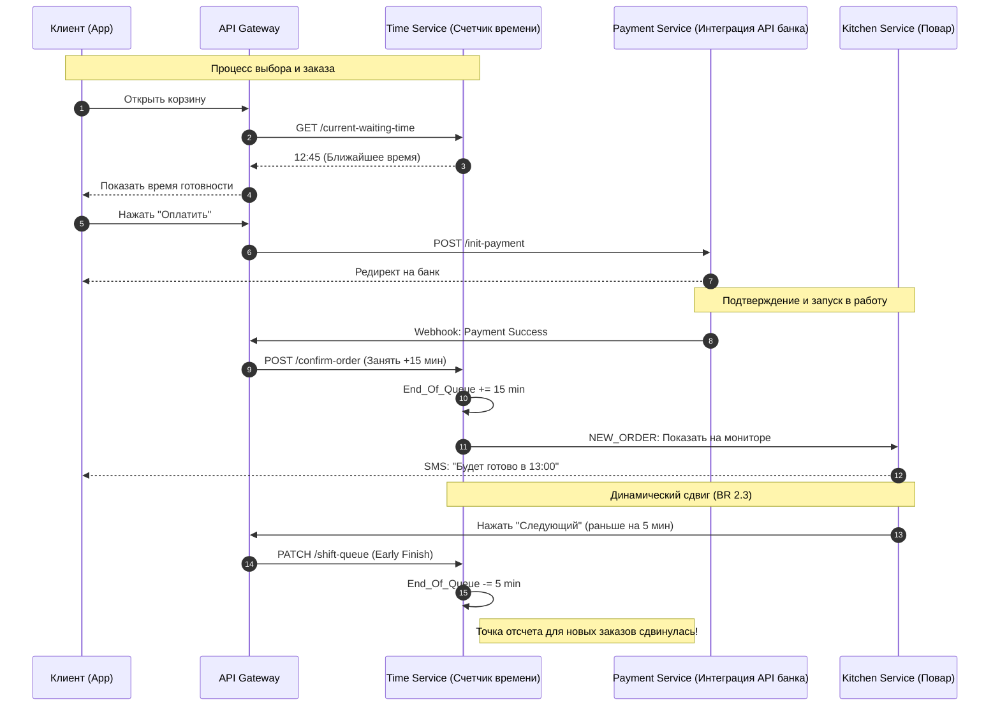

sequenceDiagram

```mermaid
sequenceDiagram
    autonumber
    participant C as Клиент (App)
    participant G as API Gateway
    participant S as Time Service (Счетчик времени)
    participant P as Payment Service (Интеграция API банка)
    participant K as Kitchen Service (Повар)

    Note over C, S: Процесс выбора и заказа
    C->>G: Открыть корзину
    G->>S: GET /current-waiting-time
    S-->>G: 12:45 (Ближайшее время)
    G-->>C: Показать время готовности

    C->>G: Нажать "Оплатить"
    G->>P: POST /init-payment
    P-->>C: Редирект на банк

    Note over P, K: Подтверждение и запуск в работу
    P->>G: Webhook: Payment Success
    G->>S: POST /confirm-order (Занять +15 мин)
    S->>S: End_Of_Queue += 15 min
    S->>K: NEW_ORDER: Показать на мониторе
    K-->>C: SMS: "Будет готово в 13:00"

    Note over K, S: Динамический сдвиг (BR 2.3)
    K->>G: Нажать "Следующий" (раньше на 5 мин)
    G->>S: PATCH /shift-queue (Early Finish)
    S->>S: End_Of_Queue -= 5 min
    Note right of S: Точка отсчета для новых заказов сдвинулась!
```
